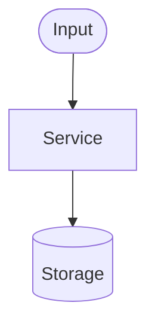

# About Me
Senior software developer learning ML/AI, preparing this repo as a portfolio for a future job
search in AI/ML engineering. Before writing code, explain your approach and the ML-specific
reasoning (why this method, this pattern, this design). Optimize for understanding over delivery
speed. Show evidence — run the code and show real output, never assert it works. Comment the
non-obvious ML/agent decisions.

Every project added here should be portfolio-quality: README with architecture diagram, clean
pre-commit, synthetic data only, and professional commit history.

# Structure
agentic-loop/              — agentic loop demos (tool use, memory, RAG, reflection, parallel tools)
agentic-loop/multi-agent/  — multi-agent orchestration (orchestrator+workers, pipeline, parallel specialists)
eligibility-agent/         — CDK stack: SQS → Lambda → Bedrock → DynamoDB
first-agent/               — first Bedrock API call, prompt engineering demos
prompt_engineering/        — prompt technique demos (temperature, chaining, guardrails)
hooks/                     — pre-commit hooks (PHI scanner, commit msg enforcer, AI review)
docs/                      — learning summary and AI engineer plan

# Commands
Run a demo:         AWS_PROFILE=cdk-dev python agentic-loop/multi-agent/multi_agent_demo.py
Lint:               flake8 .
Format:             black .
Pre-commit (all):   pre-commit run --all-files
CDK deploy:         cd eligibility-agent && cdk deploy (requires AWS_PROFILE=cdk-dev)

# Conventions
- All Bedrock calls: temperature=0.0 in inferenceConfig set per call — no shared config propagates
- All agent outputs: enforce JSON, parse with parse_bedrock_json() (strips markdown fences)
- No PHI in code — use synthetic member IDs only (e.g. MBR-2024-001)
- AWS_PROFILE and AWS_REGION always from os.getenv(), never hardcoded
- Commit message format: CATEGORY: description (FEAT, FIX, DOCS, CHORE, REFACTOR)

# Never Do
- Never hardcode AWS credentials, profile names, or region strings
- Never commit real member IDs, SSNs, DOBs, or any PHI
- Never skip inferenceConfig on a Bedrock agent call
- Never save to DynamoDB when stopReason is max_tokens (truncated response)

# New Project Checklist

## Before First Commit
- [ ] Create `<project>/README.md` using the template below
- [ ] Draw a Mermaid architecture diagram if the project uses >2 AWS services
- [ ] Run `pre-commit run --all-files` — all hooks pass
- [ ] Run PHI check manually: `python hooks/check-phi.py <files>`
- [ ] Add one row to the Quick Navigation table in root `README.md`

## README Template (copy and fill in)

```markdown
# <Project Name>

One or two sentences: what problem does this solve?

## Architecture



## What it demonstrates

| Concept | Where |
|---------|-------|
| ... | ... |

## Run

```bash
AWS_PROFILE=cdk-dev python <entry_point>.py
```

## AWS Services

| Service | Role |
|---------|------|
| ... | ... |
```

## After Each Session
- [ ] Update `docs/learning-summary.md` with session number and key takeaways
- [ ] Commit: `DOCS: update learning summary — Session N <topic>`

## Rule: Demo vs Standalone Repo
- **Demo / learning script** → add to `amazon-bedrock-demos` (this repo)
- **Deployable project, end-to-end product, or resume bullet** → new standalone repo
  - Use structure: `src/`, `infra/`, `tests/`, `requirements.txt`, `.pre-commit-config.yaml`, `LICENSE`
