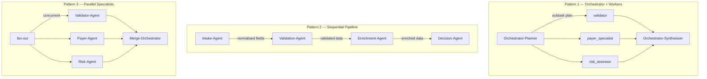

# Multi-Agent Orchestration — 3 Patterns

Three production-grade multi-agent patterns implemented with the Bedrock
Converse API and Claude Sonnet. All patterns process the same healthcare
eligibility transaction so results are directly comparable.

## Patterns

| Pattern | When to use | Agents | Flow |
|---------|-------------|--------|------|
| **Orchestrator + Workers** | Tasks with subtasks of different types | Planner, 3 workers, Synthesiser | Orchestrator plans → workers run in priority order → Orchestrator synthesises |
| **Sequential Pipeline** | Each step enriches data for the next | Intake, Validation, Enrichment, Decision | Each agent's full output becomes the next agent's input |
| **Parallel Specialists** | Independent analyses that can run concurrently | 3 specialists + Merge Orchestrator | Fan-out via `ThreadPoolExecutor` → fan-in via Merge Orchestrator |

## Architecture



## When to use each pattern

**Orchestrator + Workers** — Use when a task has clearly separable subtasks
with different expertise requirements and the subtask list isn't known until
the orchestrator sees the input. The orchestrator determines the work split
dynamically (its output is a JSON plan).

**Sequential Pipeline** — Use when each step must see the enriched output
of the prior step before it can do its job. Validation needs normalised
fields; enrichment needs validated data; decision needs all prior context.
Data accumulates as it flows through the pipeline.

**Parallel Specialists** — Use when three or more independent analyses need
to run and latency matters. Each specialist sees the same original
transaction; none depends on the others' output. The merge step is the only
sequential bottleneck.

## Key implementation detail: `temperature=0.0`

Every `call_agent()` invocation sets `temperature=0.0`. Non-deterministic
orchestrators produce different plans on identical inputs, making the entire
downstream pipeline non-deterministic and non-auditable for HIPAA compliance.
This is commented in the source at the `inferenceConfig` line.

## Run

```bash
AWS_PROFILE=cdk-dev python agentic-loop/multi-agent/multi_agent_demo.py
```

Output shows each agent's response, token count, and elapsed time.
Pattern 3 prints a sequential baseline and the measured speedup.

## File

| File | Contents |
|------|----------|
| `multi_agent_demo.py` | All 3 patterns in one script, ~436 lines |
