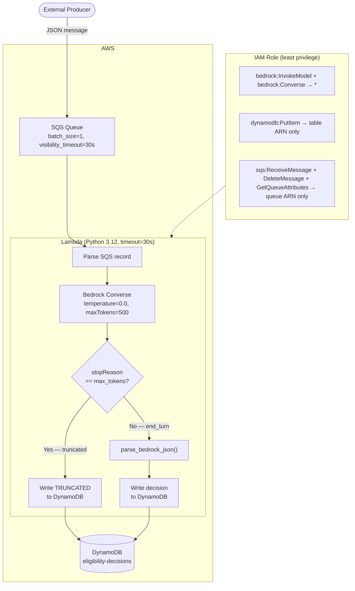

# Eligibility Agent — Production CDK Pipeline

Serverless pipeline that reads healthcare eligibility transactions from SQS,
classifies them with Claude via Amazon Bedrock, and persists decisions to
DynamoDB. Deployed with AWS CDK; includes IAM least-privilege design and a
truncation guard that prevents incomplete data from reaching the database.

## Architecture



## Key Design Decisions

### Truncation guard (`stopReason == max_tokens`)
The most important safety invariant in the handler. If Bedrock hits
`maxTokens=500` mid-response, the JSON output is incomplete and
`json.loads()` would fail silently or produce a partial record. The guard
catches this before writing, stores an explicit `analysis_error: "TRUNCATED"`
flag in DynamoDB, and logs a structured WARNING. This prevents bad data from
entering downstream systems.

### IAM least privilege
The Lambda role is scoped to exact ARNs — `dynamodb:PutItem` on the specific
table ARN, not `dynamodb:*`. Bedrock resources must use `"*"` (no ARN-level
scoping in Bedrock IAM as of CDK v2). The SQS policy includes
`sqs:DeleteMessage` because the SQS event source trigger requires it to
acknowledge processed messages.

### `batch_size=1`
Processing one SQS message per Lambda invocation keeps the handler simple
(single-record logic, no partial-batch failure handling) and ensures
`visibility_timeout >= Lambda timeout` (both 30 s).

### `temperature=0.0`
Eligibility decisions are deterministic classification tasks — the same
transaction must always produce the same decision for HIPAA auditability.

## Files

| File | Purpose |
|------|---------|
| `eligibility_stack.py` | CDK stack: SQS, Lambda, DynamoDB, IAM role with least-privilege policies |
| `app.py` | CDK app entry point |
| `lambda/handler.py` | Lambda handler — SQS → Bedrock Converse → DynamoDB, with truncation guard |
| `requirements.txt` | `aws-cdk-lib`, `constructs`, `boto3` |

## Deploy

```bash
cd eligibility-agent
pip install -r requirements.txt
cdk bootstrap --profile cdk-dev   # first time only
cdk deploy --profile cdk-dev
```

## Test (send a message)

```bash
aws sqs send-message \
  --queue-url $(aws sqs get-queue-url --queue-name eligibility-queue \
                --query QueueUrl --output text --profile cdk-dev) \
  --message-body '{"member_id":"MBR-2024-001","payer_name":"Aetna","service_date":"2026-06-24","service_type":"knee surgery"}' \
  --profile cdk-dev
```

## AWS Services

| Service | Role |
|---------|------|
| Amazon SQS | Message queue; decouples producer from Lambda |
| AWS Lambda | Python 3.12 runtime; processes one message per invocation |
| Amazon Bedrock | Claude Sonnet inference via Converse API |
| Amazon DynamoDB | Persistent store for eligibility decisions |
| AWS CDK | Infrastructure as code; provisions all resources |
| AWS IAM | Least-privilege execution role for Lambda |
