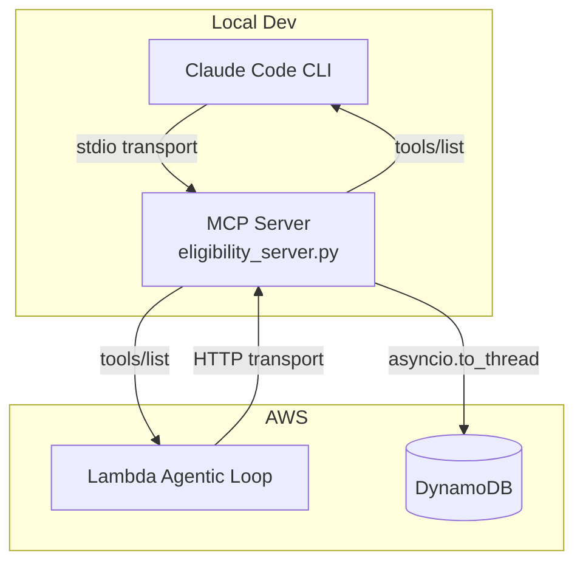

# MCP Server — Healthcare Eligibility Tools

Demonstrates the Model Context Protocol (MCP): a standard for exposing tools to
AI models so any MCP-compatible client (Claude Code, Lambda agents) can discover
and call them without per-client tool definitions.

## Architecture



## What it demonstrates

| Concept | Where |
|---------|-------|
| MCP server with two tools | `eligibility_server.py` |
| Auto-generated JSON schema from type hints | `@mcp.tool()` decorator on each handler |
| `asyncio.to_thread()` for non-blocking boto3 calls | `get_member_history_dynamo()` |
| stdio transport (Claude Code) | `mcp.run()` default in `eligibility_server.py` |
| HTTP transport (remote/Lambda) | `mcp.run(transport="streamable-http")` — swap in when deploying |
| Client-side tool filtering | `TOOLS_FOR_THIS_LAMBDA` in `lambda_client_demo.py` |
| Agentic loop using MCP tools | `run_eligibility_agent()` in `lambda_client_demo.py` |

## Run

**Lambda client demo (end-to-end against real Bedrock):**
```bash
cd mcp-server
AWS_PROFILE=cdk-dev python lambda_client_demo.py
```

**MCP server only (verify tools/list response):**
```bash
mcp dev eligibility_server.py
```

## Connect to Claude Code

Add to `~/.claude/settings.json`:
```json
{
  "mcpServers": {
    "eligibility-tools": {
      "command": "python",
      "args": ["/absolute/path/to/mcp-server/eligibility_server.py"],
      "env": {
        "AWS_PROFILE": "cdk-dev",
        "AWS_REGION": "us-east-1"
      }
    }
  }
}
```

Restart Claude Code, then run `/mcp` to confirm the server is connected.

## Remote deployment

To deploy the server (ECS Fargate / EC2) and connect Claude Code to it remotely,
change the server entry point:
```python
mcp.run(transport="streamable-http", host="0.0.0.0", port=8000)
```

And update `~/.claude/settings.json` to use `url` instead of `command`:
```json
{
  "mcpServers": {
    "eligibility-tools": {
      "url": "https://mcp.your-company.com/mcp",
      "headers": { "Authorization": "Bearer ${MCP_API_KEY}" }
    }
  }
}
```

## AWS Services

| Service | Role |
|---------|------|
| Amazon Bedrock | Claude Sonnet — eligibility decision in `lambda_client_demo.py` |
| DynamoDB | Member history store (mock in demo, real pattern in `get_member_history_dynamo`) |
